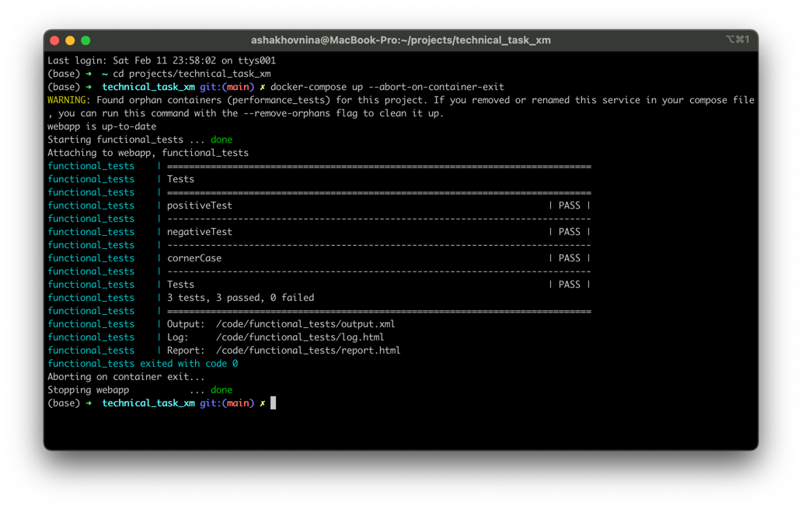
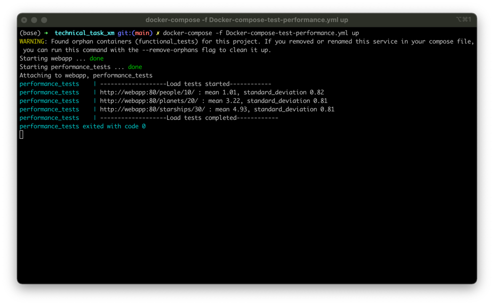

### Run functional tests

```
docker-compose up --abort-on-container-exit
```


### Run performance tests:
```
docker-compose -f Docker-compose-test-performance.yml up
```


### Rationale for the tools selectioner

1.	I decided to use Docker containers to make my solution platform-independent, as far as I don't have Windows, which is specified as the target platform in the requirements. Parameter '--abort-on-container-exit' ensures that the web server will be shut after tests are completed.

2.	I used the Robot framework for functional tests because it is a job requirement. Tests cover only one endpoint because the rest are the same, saving the reviewer's time and a few kilobytes of GitHub storage.

3.	I would use the locust library for performance testing, but the reviewer would probably want to see my ability to write code, so I reinvented the bicycle with some inheritance.

4.	I could have reinvented one more bicycle, calculating standard deviation with list comprehension, but statistics mistakes could be crucial, so I used a reliable function of the standard Python library.


Thanks for such an exciting and realistic trial task!

